# reduccion-de-la-dimension-PCA-I-SVD-II
El Análisis de Componentes Principales (PCA), es una técnica para la reducción de dimensionalidad en conjuntos de datos complejos; mientras que la SVD (Descomposición en Valores Singulares) permite identificar características comunes en los datos y reducir el número de dimensiones necesarias para su análisis

# la dimension PCA 
***Implementación práctica con Python***

Nos enfocaremos en la implementación práctica de PCA utilizando Python 
Se utiliza la librería Scikit-learn; y se cubre la preparación de datos, la estandarización de variables, y la creación de un pipeline para aplicar PCA, destacando la importancia de la matriz de correlaciones para identificar relaciones significativas.

***Análisis de componentes principales***

Profundizaremos en el análisis de los componentes principales generados por PCA, incluyendo el cálculo del "porcentaje de varianza explicada" y la visualización de proyecciones de componentes. Esto nos ayudará a identificar patrones y relaciones subyacentes en los datos.

## práctica
Mediante el siguiente ejercicio se efectuará un análisis de componentes principales (PCA) para los datos de la base de Iris y se comentará sobre cuál sería el grado de explicación de la varianza. Así mismo se graficará tanto el mapa de observaciones como el de factores asociados a esa base de datos.
### paso a paso
1.	Importamos todas las paqueterias necesarias
2.	Importamos el archivo de iris
 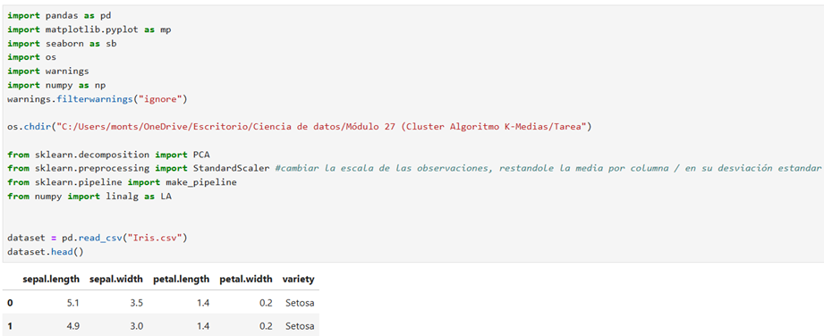

3.	Tomamos sólo las columnas que son numéricas y creamos el DataFrame
 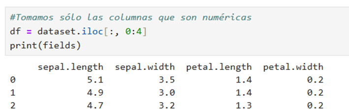

4.	Revisamos el número de renglones asignandolo en una variable, calculando las correlaciones que existen entre las columnas.
5.	Determinamos el número de renglones de la base de datos
6.	Estandarizamos las variables de la BD

7.	Creamos la matriz de correlaciones para la matriz tranformada anteriormente
 

8.	Aquí empezamos con el desarrollo de PCA para reducir las dimensiones. los dos primeros valores son los más importantes
 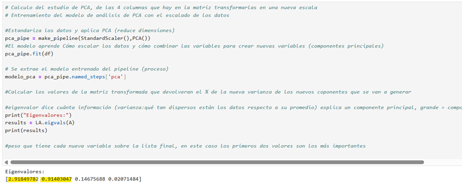

9.	Calculamos el porcentaje de la varianza explicada por cada nuevo componente
10.	Y calculamos los eigenvectores, en este caso tenemos 4 variables
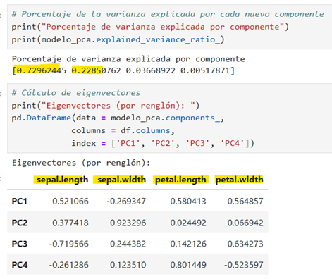
 

11.	 Proyecciones de los componentes
 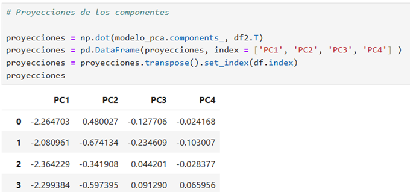

12.	Diagrama de dispersión, para saber si se agrupan en concreto o como aparecen agrupadas
 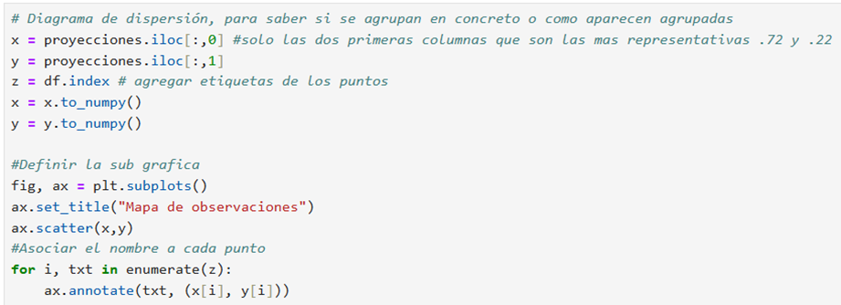
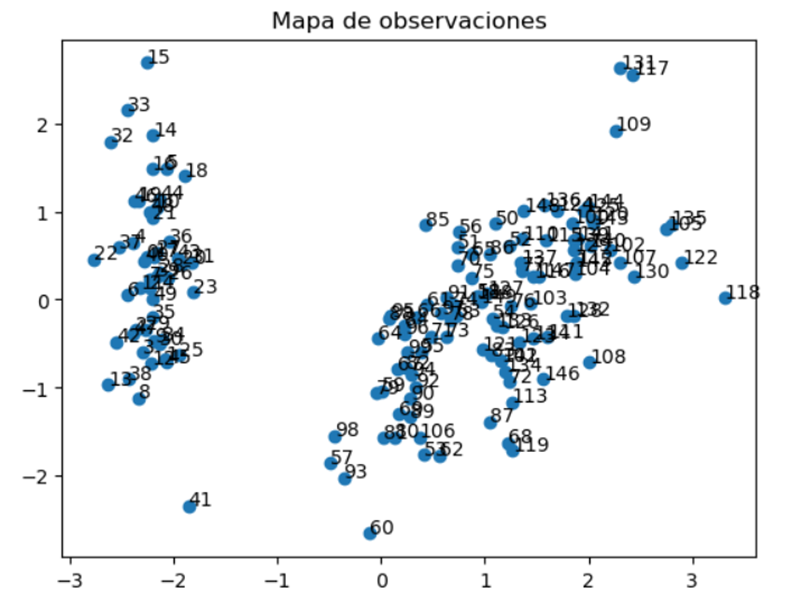

 

13.	Ahora procedemos a realizar la agrupacion en posiciones; la tabla muestra variables de cómo se relacionan con los componentes principales. 
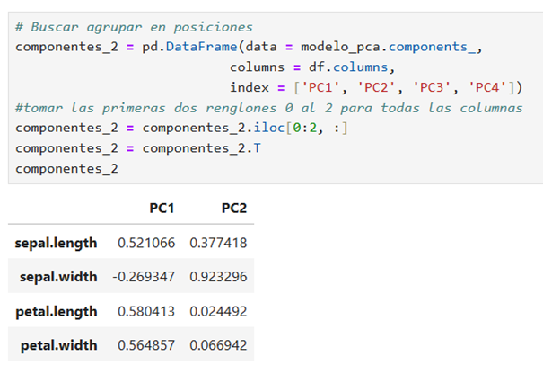
 

14.	Procedemos graficar el mapa de factores para ver los grupos como están asociados

 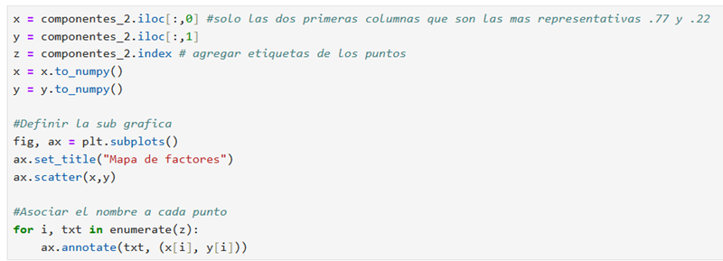

 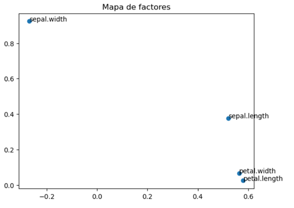

### Conclusiones

**Grado de explicación de la varianza**

Para los casos de PC1 y PC2 podemos visualizar la mayor parte significativa por un lado tenemos un PC1 = 72.96%  que es donde se captura la mayor variabilidad; es el eje más importante porque concentra casi ¾ partes de la información y para el caso de PC2 = 22.85%  aporta una parte significativa adicional. Podemos llegar a decir que ambas son el 95% de la varianza total.

PC1 + PC2 = 0.72962445 + 0.22850762 = 0.95813207 = 95%

**Mapa de observaciones como el de factores asociados a esta base de datos**

*¿Qué se puede concluir al compararlos?*

Para el mapa de observaciones cada punto representa una flor individual, estas están distribuidas en el plano PC1–PC2, que concentra el 95.8% de la varianza.
Se observan agrupamientos naturales ya que algunas flores están muy cerca entre sí, otras más alejadas.
Para el mapa de factores cada punto representa una variable original: sepal.length, sepal.width, petal.length, petal.width. En caso particular para sepal.width está en el cuadrante superior izquierdo, mientras que las otras tres están agrupadas en el inferior derecho lo que quiere decir que
sepal.width tiene una dirección de variabilidad distinta y que petal.length, petal.width y sepal.length están correlacionadas positivamente y contribuyen juntas a PC1.

Corrobore sus conclusiones al revisar casos específicos en su Data Frame.Al reducir a dos componentes principales facilita la interpretación de los clústeres porqué están más definidos y separados.
Tomando estos ejemplos:
 
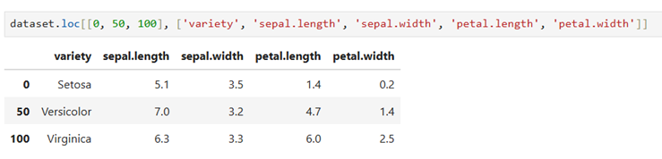
* Setosa: tiene pétalos muy cortos y estrechos, lo que hace es separarlos de las otras dos especies.
* Versicolor: medidas intermedias en pétalos, hace que queden en medio  del plano PC1–PC2.
* Virginica: pétalos largos y anchos hacen que se ubiquen en el extremo opuesto de Setosa.

> Los sépalos (length y width) muestran diferencias menores entre especies, pero los pétalos son la clave para distinguirlas.

Esto confirma lo que se vio en el mapa de factores:
* PC1 está dominado por las variables de pétalo; lo que hace separar Setosa de Virginica.
* PC2 está más influenciado por sepal.width; ayuda a dar una separación secundaria.

# la dimension SVD
***Implementación práctica con Python***

Crear gráficos tridimensionales utilizando Python y sus bibliotecas, como Matplotlib y Pandas. 

***Reducción de dimensiones***

Se explora cómo reducir matrices a dos y tres dimensiones utilizando técnicas de álgebra lineal. Esta reducción es crucial para la visualización de datos, permitiendo identificar patrones o grupos sin necesidad de etiquetas. 
## práctica
El objetivo de esta actividad es realizar un análisis de descomposición  de valores singulares a una base de datos de manera que se generen conclusiones de agrupación de acuerdo a diversas categorías.
La base de datos a utilizar es Iris.

### paso a paso

1.	Importamos todas las paqueterias necesarias
2.	Creamos el DataFrame con base en los datos
 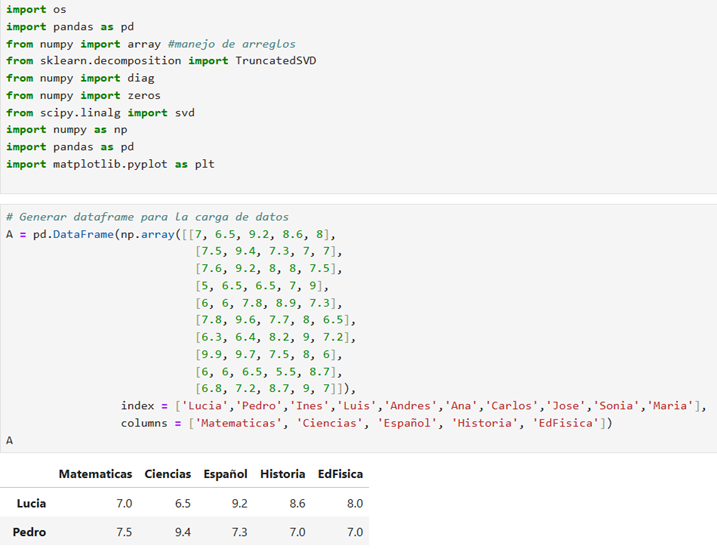

3.	Empezamos con la generación de las tres matrices V, U  y E para aplicar SVD
a.	𝑈: describe cómo se combinan las filas (los estudiantes).
b.	𝑠: son los valores singulares, que indican la "importancia" de cada componente.
c.	𝑉𝑇: describe cómo se combinan las columnas (las materias).
 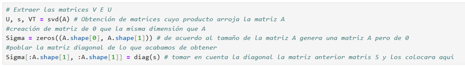
4.	Empezamos con la generación de las matrices de dos dimensiones
 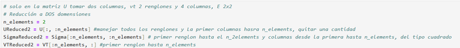

5.	Aquí ya vamos a aproximar la matriz A con base en las tres matrices anteriores; reconstruyendo una aproximación de A usando solo los dos componentes principales. Se puede observar que llegan a una aproximación similar que a la matriz principal. Ejemplo el primer dato es de 7 en matemáticas y aquí la aproximación es de 6.6, etc. 𝐴≈𝑈Reduced ΣReduced 𝑉Treduced
 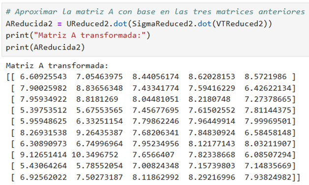

6.	Vamos a realizar el cálculo de la matriz tranformada de dos componentes; transformar los datos originales a un espacio de 2 dimensiones, ya no con 5 materias, sino con 2 coordenadas que resumen su perfil; 𝑇2 da las coordenadas de cada fila (cada estudiante). 𝑇2 = 𝑈Reduced Σreduced
 
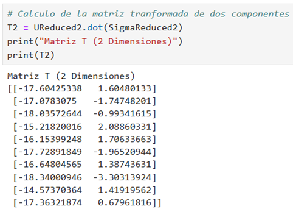

7.	Procedemos a realizar el gráfico de dispersión para revisar el agrupamiento, gráfico de 2D. Se puede apreciar que no hay como tal grupos bien definidos por lo que se tendrá que proceder a hacerlo por 3D.
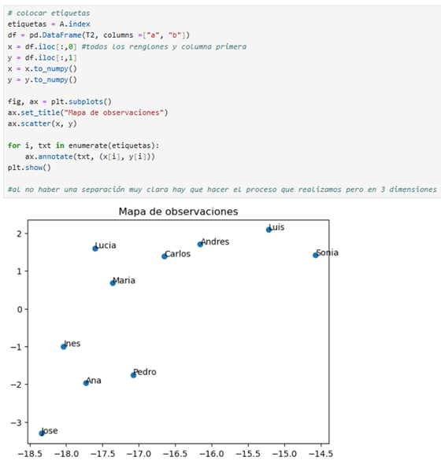
 
8.	Procedemos a realizar el gráfico de 3D para ver si hay un mejor agrupamiento y en efecto se visualizan mejor los grupos
   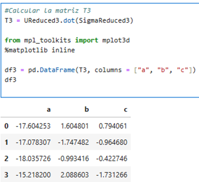
   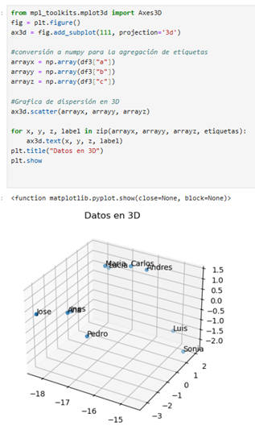

9.	Ahora claramente con la partición de 3 dimensiones se pueden apreciar mejor el agrupamiento de los alumnos, procederemos a calcular la media del error de 3D. (matriz original reconstruida completa con la aproximación reducida con solo 3 componentes)

 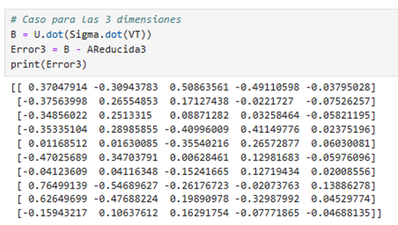
 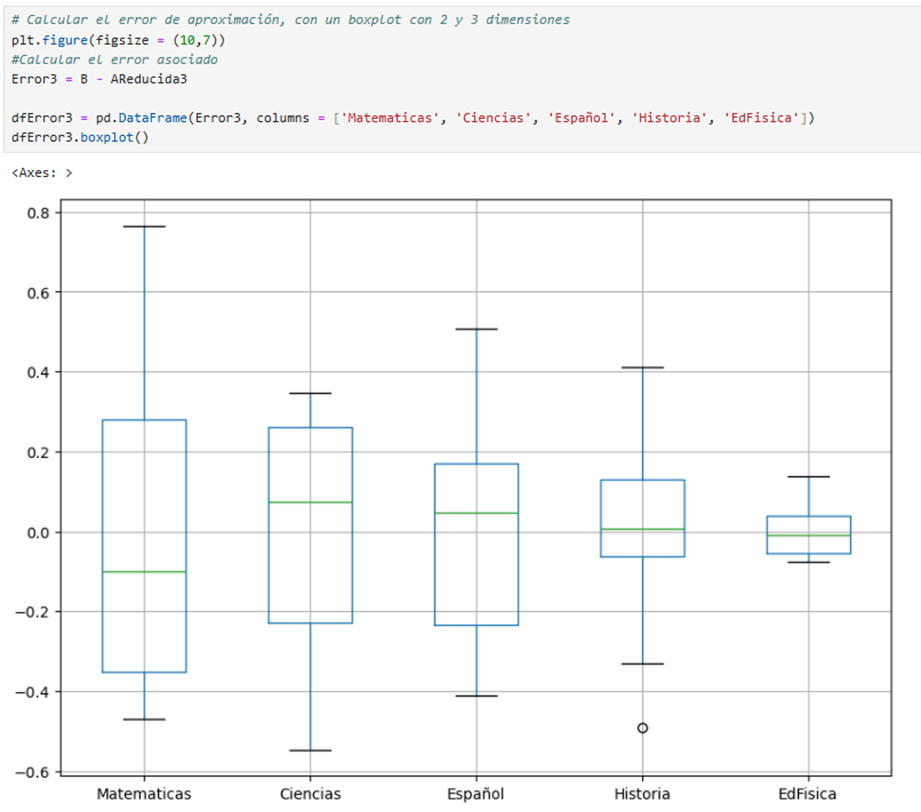

 

### Conclusiones

Sobre la media del error por materia esta es muy cercana a cero, lo que indica que la mayoría de la información relevante fue conservada.
La dispersión del error (amplitud de las cajas) es baja en casi todas las materias, lo que qere decir que no hay grandes desviaciones entre la matriz original y la reconstruida.
Pareciera que no existen outliers por lo que podemos concluir que es un buen modelo usar SVD.

¿Cuál de las separaciones previas es más clara? 
La separación más precisa fue con 3 dimensiones, en la cual se puede observar mejor un agrupamiento por alumno, a diferencia de usar 2 dimensiones no se podia ni siquiera distinguir como tal un agrupamiento ya que todos los datos estaban muy dispersos, por lo que la mejor opción fue usar 3D.

¿Difieren sus resultados de aquellos obtenidos previamente mediante el análisis de componentes principales

**PCA**                                                    
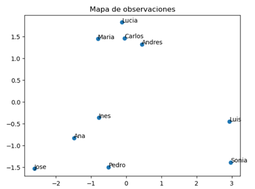  

**SVD**

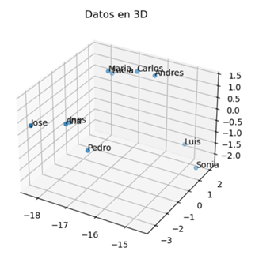
      
Al hacer el comparativo ciertamente obtuvimos el mismo resultado al tener tres grupos diferentes con los mismos alumnos, por lo que a mi gusto personal, me ha gustado más PCA ya que siento que son menos pasos y se obtiene de manera más sencillas en menos procesos.
Como una cuestión más técnica, PCA usa la matriz de covarianza y extrae los autovectores (componentes principales) y SVD descompone directamente la matriz de datos en UΣVT, y los vectores de Vson equivalentes a los componentes principales de PCA.

E investigando en la práctica, SVD es más estable numéricamente y se usa más en programación científica.
